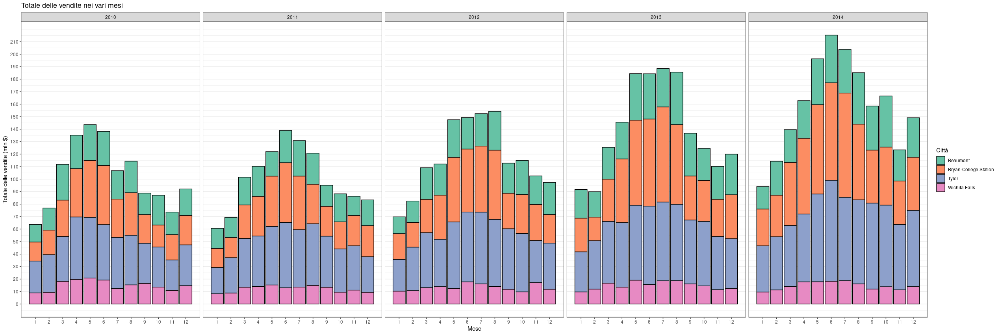

# Analisi esplorativa del mercato immobiliare del Texas

## Contenuto della repository
* `realestate_texas.csv`: il dataset
* `realestate_texas_analysis.r`: il file sorgente R
* `report_statistica_descrittiva.pdf`: report con lo svolgimento della consegna del progetto

## Descrizione del progetto
Il dataset contiene 240 osservazioni di 8 variabili, che portano informazioni riguardo le vendite mensili di immobili nelle città di Beaumont, Bryan-College Station, Tyler and Wichita Falls, dal 2010 al 2014. In dettaglio, le variabili sono:
* `city`: città
* `year`: anno di riferimento
* `month`: mese di riferimento
* `sales`: numero totale di vendite
* `volume`: valore totale delle vendite in milioni di dollari
* `median_price`: prezzo mediano di vendita in dollari
* `listings`: numero totale di annunci attivi
* `months_inventory`: quantità di tempo necessaria per vendere tutte le inserzioni correnti al ritmo attuale delle vendite, espresso in mesi.

Ho descritto le variabili del dataset creando, a seconda del tipo di variabile, tabelle delle frequenze o calcolando indici statistici. Inoltre ho usato il pacchetto `dplyr` per manipolare i dati creando indicatori aggregati, e per meglio visualizzare dati e tendenze nei dati ho creato grafici usando il pacchetto `ggplot2`.

